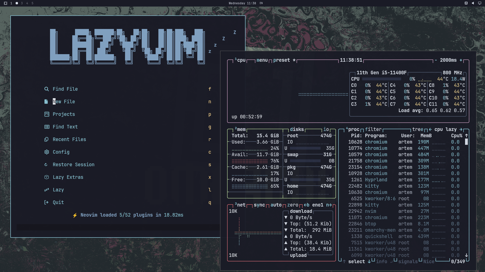

# Mac-blur-quattro

A dark, Mac-inspired glass theme for Omarchy Quattro, based on the
Nord Night palette and a complete saved desktop configuration.



## Install

Requires Omarchy 4.x with Lua-configured Hyprland.

```bash
omarchy theme install https://github.com/notzeman/Mac-blur-quattro
```

## Activate

```bash
omarchy theme set Mac-blur-quattro
```

## Appearance

- Theme-relative colors from `colors.toml`, with no fixed terminal tint.
- Native Omarchy bar at 35% opacity, with the tray on the right.
- Popup panels and hover tooltips at 55% opacity, with no outer borders.
- Omarchy root and system menus at 55% opacity, with blurred borderless cards.
- Clipboard and emoji cards use the same blur, with a clear desktop outside them.
- Hyprland blur size 7 with 3 passes.
- Ghostty at font size 10 and 55% background opacity.
- White Ghostty cursor and animated white GLSL trail.
- LookElsewhere in the center: 25-minute focus intervals, 20-second breaks,
  and a 3-minute long break every fourth break.
- Bibata Original Classic pointer at size 18.
- Night light starts at 5500K.

The theme uses Omarchy's generated application palettes. Its shell surface
colors refer to palette roles, so edits to `colors.toml` remain dynamic.

## Saved configuration

`config-snapshot/` contains the current working user configuration, including
the latest menu and clipboard blur fixes:

- `ghostty/`: terminal configuration, appearance override, and white trail shader.
- `hypr/`: personal Hyprland configuration, blur rules, bindings, and autostart.
- `omarchy/shell.json`: native-bar layout and plugin settings.
- `omarchy/themed/shell.toml.tpl`: global shell appearance template.
- `omarchy/hooks/theme-set.d/99-bibata-pointer.sh`: mouse-pointer preference.
- `gtk-3.0/` and `gtk-4.0/`: mouse-pointer settings.
- `xdg-terminals.list`: Ghostty as the default terminal.

Selecting the theme applies its palette, wallpapers, and shell appearance.
The saved Hyprland and Ghostty files provide the rest of the setup.

### Apply the saved appearance configuration

Copy `config-snapshot/ghostty/` to `~/.config/ghostty/` for font size 10,
55% transparency, and the white cursor-trail shader. Paths use `~/` so they
work with any username.

Copy or merge `config-snapshot/hypr/looknfeel.lua` into your personal
`~/.config/hypr/looknfeel.lua` to enable the included terminal, bar, flyout,
menu, clipboard, and emoji blur rules. Omarchy's main Hyprland config must
load this module with `require("hypr.looknfeel")`.

`config-snapshot/omarchy/shell.json` contains the bar layout and plugin settings.
The remaining snapshot files provide the pointer settings, night-light
autostart, keyboard shortcuts, and original monitor/input preferences.

Apply changes with:

```bash
omarchy default terminal ghostty
hyprctl reload
hyprctl configerrors
omarchy restart terminal
omarchy restart shell
```

Ghostty, hyprsunset, the Bibata Original Classic cursor theme, and the third-party
plugins referenced in `shell.json` need to be installed separately. Plugin
source, packages, clipboard history, and scheduler state are not bundled.

## Wallpapers

Theme wallpapers are in `backgrounds/`. After adding files there, refresh the
active theme and picker cache:

```bash
omarchy theme refresh
omarchy theme bg cache
```

For additions that should appear without refreshing the theme, use
`~/.config/omarchy/backgrounds/mac-blur-quattro/`.
